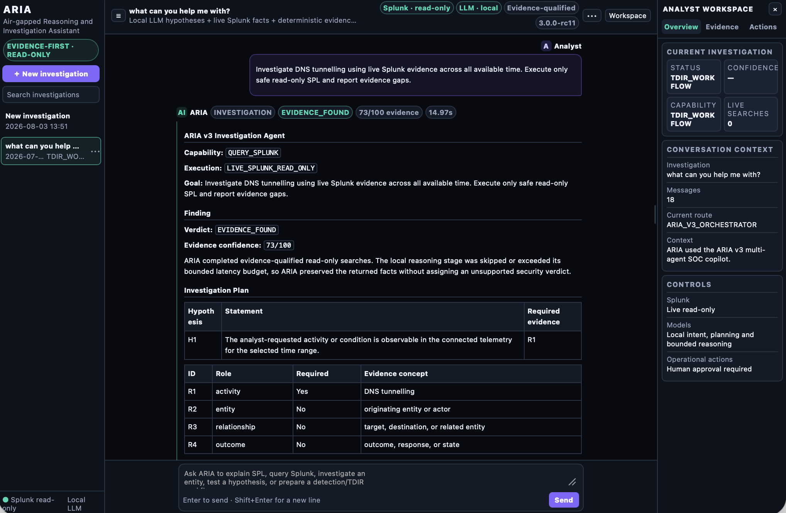
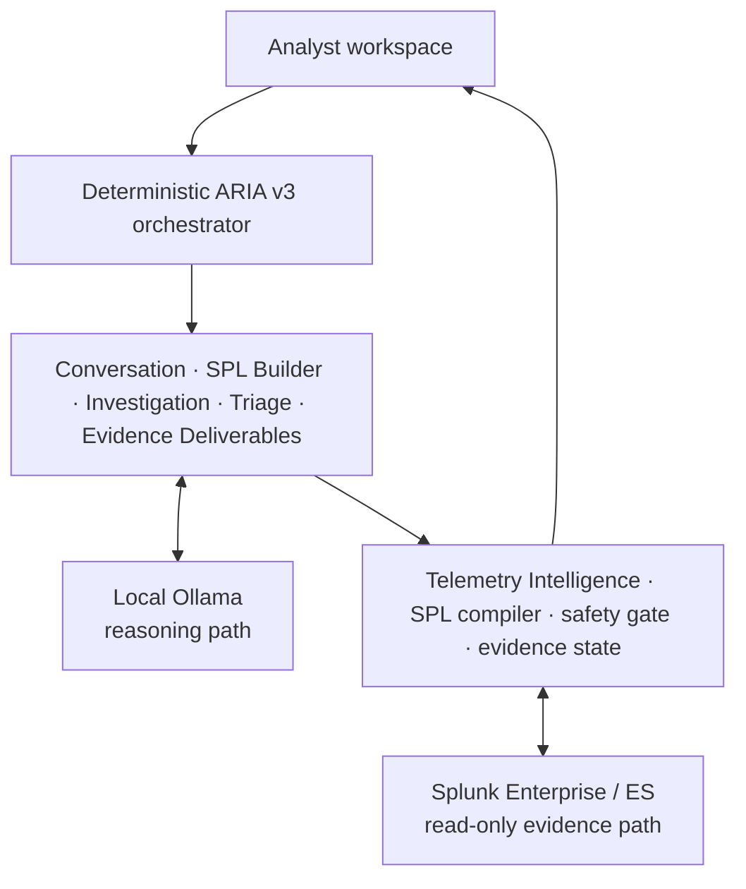
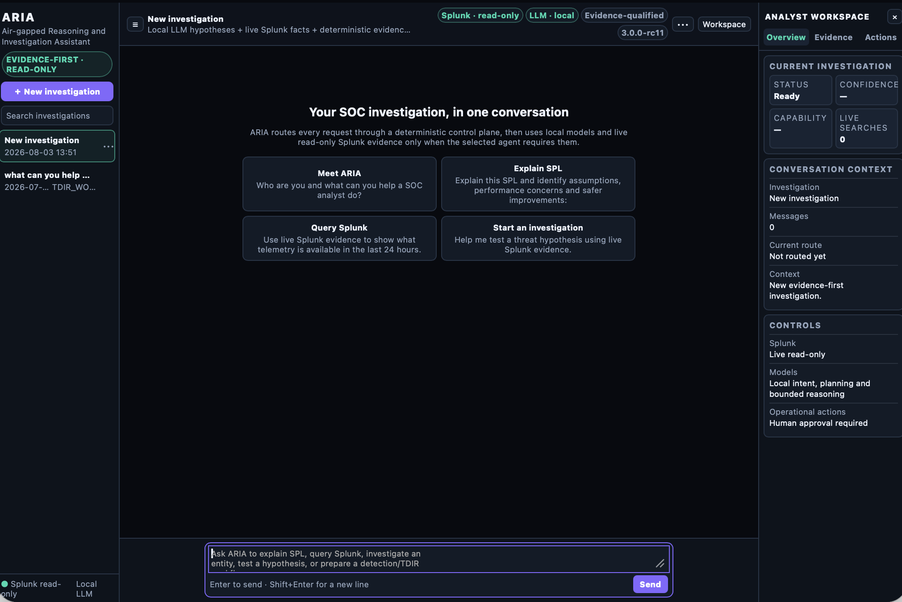
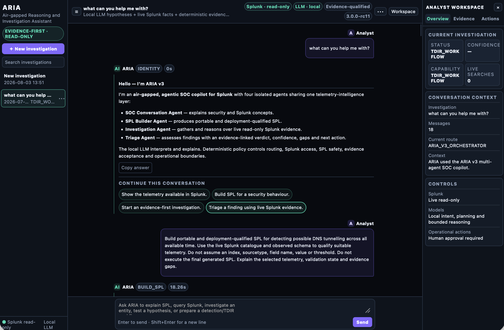
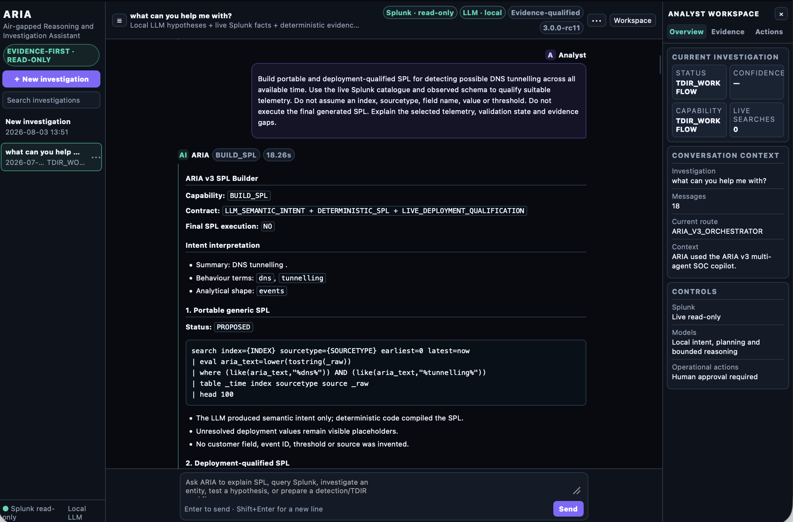

# ARIA

**Air-gapped Reasoning and Investigation Assistant**

**SEC1436 — Beyond the Wrapper: Connecting Local LLMs to Splunk for Air-Gapped Intelligence**


ARIA is an evidence-first, read-only SOC copilot for Splunk Enterprise. It connects local Ollama models to live Splunk telemetry through deterministic routing, bounded SPL execution and explicit evidence contracts—without sending prompts, credentials or telemetry to a cloud model.

> Release status: `3.0.0-rc11` controlled preview. Pattern B is the implemented downloadable product. Pattern A is validated demonstration guidance, and Pattern C is an experimental roadmap. This repository is not a production support commitment.



## Three implementation patterns

| Pattern | What it demonstrates | Repository status |
|---|---|---|
| [A — AI Toolkit `| ai` + local Ollama](patterns/pattern-a-ai-toolkit/README.md) | Fast, bounded local-model assistance inside an SPL pipeline | Validated demo pattern with five assessed use cases and screenshots |
| [B — ARIA lightweight agents](docs/ARCHITECTURE.md) | Deterministic routing, local reasoning, live read-only Splunk evidence, ledger and approval gates | Implemented v3.0.0-rc11 product source |
| [C — DSDL + private cyber RAG](patterns/pattern-c-dsdl-rag/README.md) | Private retrieval, graph context, specialist models and lifecycle workflows | Capabilities to try next; not implemented in RC11 |

Pattern A proves connectivity and immediate value. Pattern B adds the controls needed for defensible SOC workflows. Pattern C shows the future specialisation path. See the [three-pattern architecture](docs/SEC1436_THREE_PATTERN_ARCHITECTURE.md) and [side-by-side comparison](docs/PATTERN_COMPARISON.md).

## Why ARIA

Most conversational security prototypes wrap a cloud model around sensitive telemetry. ARIA keeps reasoning local and makes Splunk—not the model—the source of deployment facts.

- Deterministic, model-independent request routing.
- Local Ollama reasoning and embeddings.
- Live, read-only Splunk catalogue and schema discovery.
- Safe bounded SPL with a deterministic validator.
- Evidence-linked investigation and triage.
- Portable and deployment-qualified SPL generation.
- Source-attributed offline knowledge for public security frameworks.
- Human approval before detections, risk events or response actions.

## Product capabilities

| Capability | Purpose | Splunk execution |
|---|---|---|
| SOC Conversation | Explain cybersecurity and Splunk concepts with isolated conversational context | No |
| SPL Builder | Produce portable SPL and live-schema-qualified SPL | Qualifying probes only; generated SPL is not executed |
| Investigation | Run bounded, evidence-first searches against qualified telemetry | Read-only |
| Triage | Convert returned evidence into verdict, confidence, gaps and next action | Read-only when more evidence is required |
| Evidence Deliverables | Draft Detection Candidate, RBA/ERS, TDIR and SOAR material from current structured evidence | No |
| Telemetry Inventory | Show available indexes, sourcetypes and observed schema | Read-only |

## Pattern B runtime architecture



Models interpret and explain. Deterministic code controls routing, source qualification, SPL safety and evidence requirements.

The local model has no Splunk credentials or write authority. Splunk deployment facts are accepted only through the deterministic evidence path. Detection, risk and response artefacts remain drafts until analyst approval.

See the complete [runtime architecture, agent relationships, data flows, trust boundaries and code map](docs/ARCHITECTURE.md).

The cross-pattern deployment and data flows are documented in [SEC1436 three-pattern architecture](docs/SEC1436_THREE_PATTERN_ARCHITECTURE.md).

## Quick start

Prerequisites:

- Python 3.10 or newer
- Splunk Enterprise credentials with read-only search access
- Ollama reachable on the local or isolated network
- At least one configured chat model; an embedding model is recommended

```bash
python3 -m venv .venv
source .venv/bin/activate
pip install -r requirements.txt
cp .env.example .env
```

Populate `.env` with local endpoints and credentials, then validate:

```bash
export PYTHONPATH="$(pwd):${PYTHONPATH:-}"
python validate_product.py
python validate_runtime.py
python aria_safe_startup_check.py
python aria_health.py
python validate_v3_acceptance.py --skip-live
```

Start the gateway and UI using the supplied systemd units or:

```bash
python aria_llm_gateway.py
python web_ui.py
```

Detailed guidance:

- [Installation](docs/INSTALLATION.md)
- [Configuration](docs/CONFIGURATION.md)
- [Troubleshooting](docs/TROUBLESHOOTING.md)

## Conference demo path

Use a target deployment with known positive-control telemetry.

1. Ask `What is MITRE ATLAS?`
2. Follow with `How can a SOC use that framework to monitor AI-enabled systems with Splunk?`
3. Ask an out-of-scope question such as `Give me a butter chicken recipe.`
4. Build portable and deployment-qualified SPL.
5. Run a bounded investigation and triage the returned evidence.
6. Draft a Detection Candidate, RBA/ERS recommendation and approval-gated TDIR workflow from the same structured evidence.

The framework follow-up must remain on MITRE ATLAS, preserve authoritative facts and citations, and run no Splunk search. The out-of-scope question must be rejected without invoking a general-purpose answer.

See [docs/DEMO_GUIDE.md](docs/DEMO_GUIDE.md) for the full flow.

The exact conference prompts and expected routes are available in [docs/RC11_DEMO_PROMPTS.txt](docs/RC11_DEMO_PROMPTS.txt).

## Offline reference grounding

Public framework facts are stored in `product/knowledge/reference_cards.json`. Cards are source-attributed data, not Python branches and not customer telemetry mappings. A grounded answer must preserve configured authoritative phrases and citations.

If a grounded local-model draft times out or fails validation, ARIA immediately renders a deterministic six-section answer from the same card. Referential follow-ups use only bounded same-agent context, preventing Investigation or Triage output from contaminating the explanation.

## Safety model

- Splunk access is read-only.
- Every executable query passes the deterministic SPL validator.
- Investigation work is bounded before aggregation.
- The model cannot select a write capability or bypass evidence policy.
- No detection, notable, risk event, containment action or SOAR playbook is activated automatically.
- Customer indexes, sourcetypes, fields, values, entities and thresholds are discovered or supplied at runtime; they are not embedded in product logic.
- Full prompts are not captured by audit logging by default.

Read [SECURITY.md](SECURITY.md) and [SECURITY_MODEL.md](SECURITY_MODEL.md) before deployment.

## Validation

Package acceptance:

```bash
python validate_v3_acceptance.py --skip-live
```

Connected acceptance:

```bash
python scripts/live_v3_acceptance.py \
  --build-question 'Build SPL for analysing PowerShell encoded-command execution across all available time. Use the connected Splunk deployment to qualify the source and observed schema, but do not execute the final SPL.' \
  --investigation-question 'Investigate DNS tunnelling using live Splunk evidence across all available time.' \
  --conversation-question 'What is MITRE ATLAS?' \
  --conversation-followup-question 'How can a SOC use that framework to monitor AI-enabled systems with Splunk?'

python validate_v3_acceptance.py
```

The connected investigation prompt is an example. Select a scenario with known positive-control telemetry in your target deployment.

The package suite also replays the exact conference routing flow through the complete orchestrator. It blocks misrouting between Identity, SPL Builder, SPL Review, Safety, Detection Candidate, RBA/ERS, TDIR and Scope Guard.

Connected acceptance also requires `ARIA_V3_DELIVERABLE_LIVE_ACCEPTANCE=PASS`, proving that live Investigation evidence survives Triage and all three post-investigation deliverables without a new search or operational action.

## Building release archives

```bash
python scripts/build_product_release.py
python scripts/audit_release_artifact.py
python scripts/build_github_source.py
python scripts/audit_github_release.py
```

The GitHub audit is a technical sanitization check. Review [PUBLIC_RELEASE_CHECKLIST.md](PUBLIC_RELEASE_CHECKLIST.md) and obtain the required organisational IP, licence and branding approvals before public publication.

## Documentation

- [Three-pattern SEC1436 architecture](docs/SEC1436_THREE_PATTERN_ARCHITECTURE.md)
- [Pattern comparison and selection guidance](docs/PATTERN_COMPARISON.md)
- [Three-pattern theatre demo runbook](docs/SEC1436_DEMO_RUNBOOK.md)
- [Pattern A: AI Toolkit to local Ollama](patterns/pattern-a-ai-toolkit/README.md)
- [Pattern A validated use cases](patterns/pattern-a-ai-toolkit/USE_CASES.md)
- [Pattern C: DSDL and private cyber RAG](patterns/pattern-c-dsdl-rag/README.md)
- [Pattern C capabilities to try next](patterns/pattern-c-dsdl-rag/CAPABILITIES_TO_TRY_NEXT.md)
- [Complete architecture and data flows](docs/ARCHITECTURE.md)
- [RC11 architecture contract](docs/V3_ARCHITECTURE.md)
- [Acceptance criteria](docs/V3_ACCEPTANCE.md)
- [Release notes](docs/V3_RELEASE_NOTES.md)
- [Demo guide](docs/DEMO_GUIDE.md)
- [Exact RC11 demo prompts](docs/RC11_DEMO_PROMPTS.txt)
- [Operator guide](README_ARIA_OPERATOR_GUIDE.md)
- [Safety policy](docs/SAFETY_POLICY.md)
- [Repository contents](docs/REPOSITORY_CONTENTS.md)
- [Publish from macOS using the GitHub web UI](docs/GITHUB_UI_PUBLISHING.md)

## UI views

| Analyst workspace | Agent capabilities |
|---|---|
|  |  |

| Deployment-qualified SPL | Evidence-first Investigation |
|---|---|
|  |  |

Screenshots contain generic demonstration prompts and are not evidence of a customer deployment. Live results and qualification states depend on the connected Splunk telemetry.

Pattern A screenshots and their accuracy assessment are available in [the Pattern A guide](patterns/pattern-a-ai-toolkit/README.md). They contain public laboratory/demo data and intentionally illustrate why model output still requires validation.

## Publishing through the GitHub UI

The publication kit includes hidden repository files and checksum-verified release assets. Follow [the macOS GitHub web upload guide](docs/GITHUB_UI_PUBLISHING.md), then require the `Validate ARIA RC11` workflow to pass before creating the pre-release.

## Project status and support

ARIA is a research and conference demonstration release candidate. Interfaces, schemas and deployment procedures may change before a stable release. Use a non-production Splunk environment or an explicitly approved read-only account.

## Licence and attribution

Source code is offered under the Apache License 2.0, subject to the approvals listed in `PUBLIC_RELEASE_CHECKLIST.md`. MITRE ATT&CK and MITRE ATLAS are MITRE Corporation resources and trademarks; Splunk is a trademark of Splunk LLC. See [NOTICE](NOTICE).
