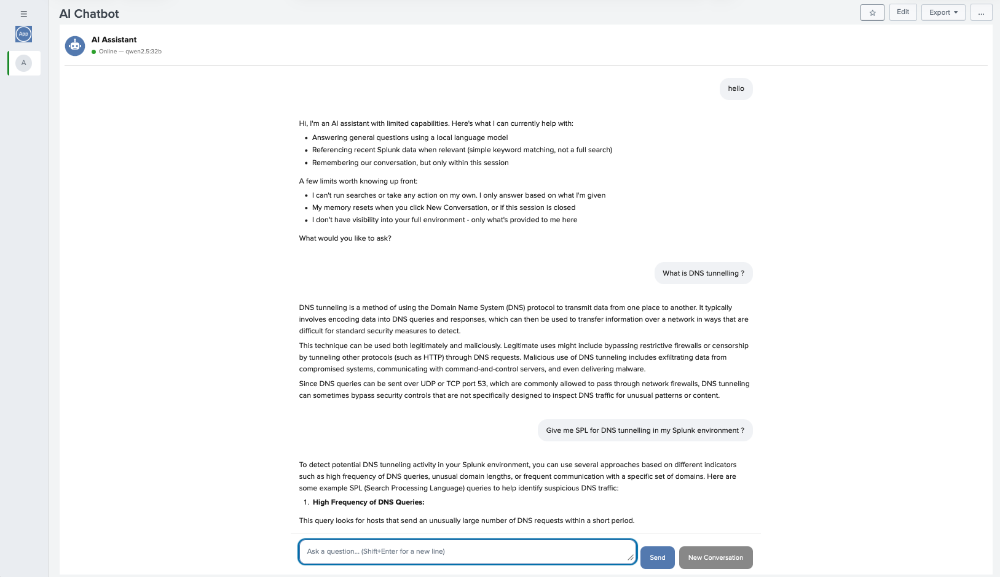
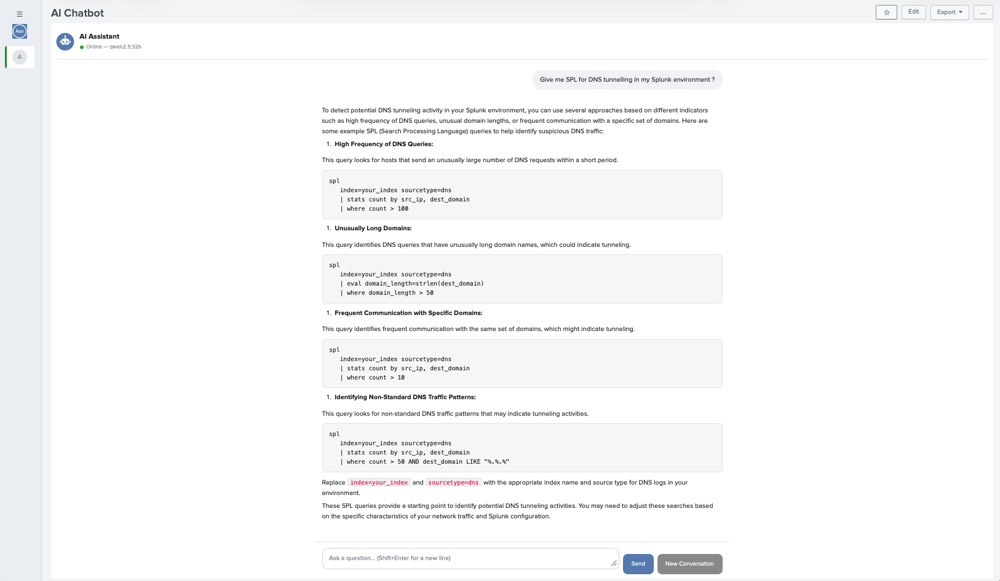
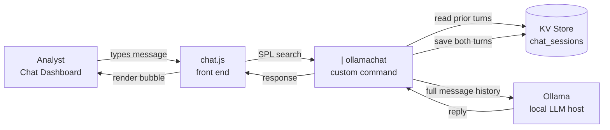

# AI Chatbot for Splunk — Air-Gapped Defence SOC

A conversational AI assistant embedded directly inside Splunk, running entirely within an air-gapped network. No cloud APIs, no external calls — analysts ask questions in plain English from inside a Splunk dashboard and get answers grounded in the SOC's own knowledge, powered by a locally hosted LLM (Ollama).

---

## What This App Is

Analysts spend a meaningful chunk of their day translating plain-English questions into SPL, looking up MITRE ATT&CK references, or writing up incident summaries by hand. This app puts a chat interface directly into Splunk to shortcut that — a genuine multi-turn conversation, not a one-shot search box, running fully inside the accreditation boundary.

It's built as a standard Splunk app: a custom search command bridges Splunk to a local LLM, a KV store collection gives it real conversation memory, and a lightweight dashboard provides the chat UI. Nothing leaves the network — the LLM itself runs on an internal, air-gapped host.

## How It Works

1. An analyst opens the **AI Chatbot** dashboard inside Splunk and types a question.
2. The dashboard's JavaScript sends the message to a custom SPL command, `| ollamachat`.
3. That command looks up the conversation's prior turns from a KV store, appends the new message, and sends the full conversation to the local LLM.
4. The LLM's reply comes back, gets saved to the KV store (for the next turn), and renders in the chat window as a bubble.

No external network calls at any point — the LLM endpoint is an internal IP with no egress path.

## Screenshots

**A full multi-turn conversation**, showing the live status badge (green = online, with the actual connected model name), the welcome message, and the full-width, centered-column layout:



**Formatted SPL output** — numbered steps, bolded headings, and syntax-styled code blocks with inline field highlighting, instead of one dense wrapped paragraph:



## Value for the Customer

- **Faster triage and investigation** — analysts get plain-English answers, drafted SPL, and technique explanations without leaving Splunk or waiting on a senior analyst.
- **Air-gap native** — no compromise on the accreditation boundary; the LLM never leaves the network, and the whole data flow is a single, easy-to-document internal hop.
- **Built on what's already there** — no new platform to license or operate; it's a Splunk app running on infrastructure the customer already owns.
- **A visible, tangible AI/ML win** — often the first thing stakeholders actually *see* working, ahead of the less visually obvious ML detections running in the background.
- **A foundation, not a dead end** — the same `| ollamachat` pattern extends directly into the higher-value use cases already scoped for this environment: alert triage enrichment, incident narrative drafting, detection-authoring assistance, and anomaly explainability.

## Architecture & Memory/Context



**Why a custom command instead of a single `| ai` call:** a one-shot prompt-in/text-out call has no memory of earlier turns. `ollamachat` instead builds a proper `messages` array (system/user/assistant roles) on every call, the same shape Ollama's native `/api/chat` endpoint expects — that's what makes it a real conversation rather than a series of unrelated questions.

**How conversation memory works:**
- Each browser session generates a random `session_id` when the chat page loads.
- Every message and reply is written to a `chat_sessions` KV store collection, tagged with that `session_id` and a `turn_index`.
- On each new message, `ollamachat` pulls every prior turn for that `session_id`, in order, and sends the whole conversation to the LLM — so it genuinely remembers what was said earlier in the same session.
- Clicking **New Conversation** simply generates a fresh `session_id` client-side; old sessions aren't deleted, just no longer referenced, and age out via a retention policy.
- This also means every conversation is logged by design — useful both for debugging and as an audit trail in a Defence environment.

**Where each piece lives (Splunk app structure):**
```
chatbot_app/
├── default/
│   ├── app.conf              # app identity
│   ├── commands.conf         # registers | ollamachat (generating = true — required for
│   │                         #   a GeneratingCommand to be valid as the first pipe command)
│   ├── collections.conf      # defines the chat_sessions KV store
│   ├── metadata/default.meta # sharing/permissions
│   └── data/ui/
│       ├── views/chatbot.xml # the dashboard itself
│       └── nav/default.xml   # app navigation
├── bin/
│   ├── ollamachat.py         # the custom command — the Splunk↔LLM bridge
│   └── splunklib/            # vendored Splunk SDK (see Troubleshooting — not bundled
│                              #   by default on every Splunk build)
└── appserver/static/
    ├── chat.js                # chat UI logic, session handling
    └── chat.css                # chat bubble styling
```

## Download

The full, ready-to-install Splunk app package is included in this folder: **[`chatbot_app.tar.gz`](chatbot_app.tar.gz)**. It contains everything needed to deploy — the custom search command, the bundled `splunklib` dependency, the dashboard, and the front-end chat UI. Click that link on GitHub and use the **Download raw file** button to grab it.

## Setup

1. Download `chatbot_app.tar.gz` from this folder (see above).
2. Install via Splunk Web (**Apps → Manage Apps → Install app from file**) or by extracting directly into `$SPLUNK_HOME/etc/apps/` over SSH.
3. Set the real LLM endpoint in `bin/ollamachat.py` (`OLLAMA_URL`) — this is environment-specific and won't be committed with a real IP in this repo.
4. Restart Splunk.
5. Test the backend directly before touching the dashboard: `| ollamachat session_id="test1" user_message="hello"`, run from *inside* the app's own context.

## Troubleshooting Notes (from real deployment)

A few non-obvious issues came up getting this running in an actual air-gapped environment — worth knowing before you hit them yourself:

| Symptom | Cause | Fix |
|---|---|---|
| `Unknown search command 'ollamachat'`, despite it showing as registered in Settings | The command is scoped to its own app by default; running it from a different app context (e.g. Search & Reporting) won't find it | Test from inside the app's own context, or note this is expected behaviour, not a bug |
| Splunk's Permissions UI fails with `"This handler does not support the 'edit' action"` | commands.conf entries aren't ACL-editable knowledge objects the way saved searches are | Don't use the Permissions page for commands — sharing is controlled via `metadata/default.meta` at package time instead |
| `ModuleNotFoundError: No module named 'splunklib'` | Not every Splunk build ships the Python SDK for custom commands | Vendor `splunklib` directly into the app's `bin/` folder (from the official `splunk-sdk` PyPI package) |
| Command still "unknown" with everything else correct | `commands.conf` defaulted to `generating = false` | `GeneratingCommand`-based commands need `generating = true` explicitly set |
| `gzip: stdin: not in gzip format` on extraction | macOS browsers (Safari) often silently decompress `.tar.gz` downloads | Extract with plain `tar -xf` (auto-detects format) instead of `tar -xzf` |
| `NameResolutionError` on a placeholder-looking hostname | Template placeholder in `OLLAMA_URL` never replaced with the real address, or a stray `<`/`>` left in during editing | Confirm the exact string with `grep ollama_url default/ai_chatbot_settings.conf` before assuming it's a network problem |
| `service.confs[...]` fails with `HTTP 404 Not Found -- Action forbidden` | Splunk's REST config API can be restricted in locked-down environments | Read `.conf` settings directly off disk (`configparser`) instead of via `service.confs` — see `bin/chatbot_settings.py` |
| Layout/formatting changes don't appear after redeploying | Browser aggressively caches static JS/CSS; Splunk doesn't auto-bust that cache when app files are replaced on disk | Hard refresh (Cmd+Shift+R / Ctrl+Shift+R) after every redeploy that touches `appserver/static/` |
| `.tar.gz` file changes never show up in `git status` after committing | A blanket `*.tar.gz` rule in `.gitignore` silently excludes the app package from every commit | Add a specific exception (`!path/to/chatbot_app.tar.gz`) and `git add -f` it once |

## Roadmap

This chatbot is the first use case built on this pattern. Scoped next, using the same `| ollamachat`-style bridge:
- Alert enrichment & triage summaries attached automatically to ES notables
- Incident narrative and closure-justification drafting
- CTI-to-detection drafting (two-stage: LLM draft → deterministic validation)
- MLTK anomaly detection paired with LLM-generated, evidence-grounded explanations
