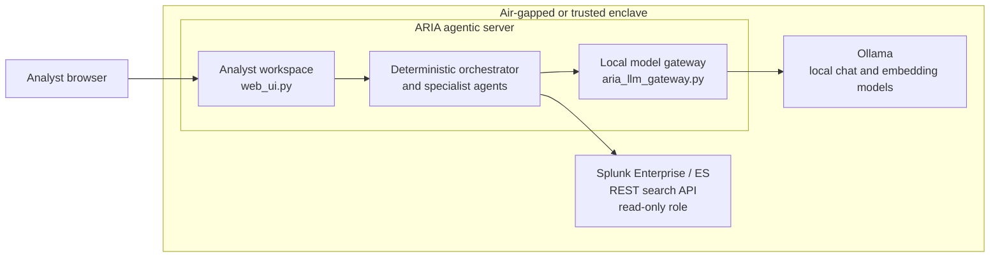
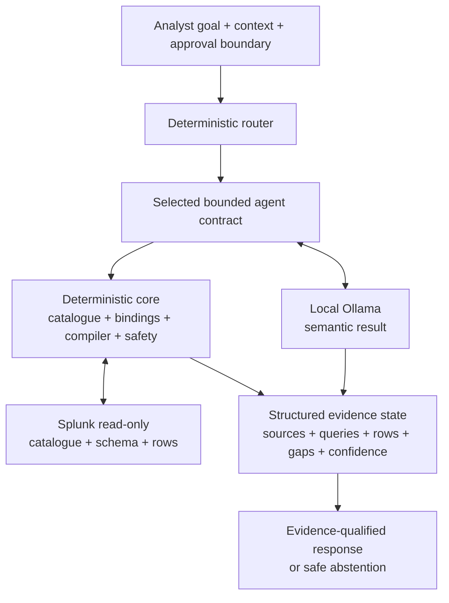
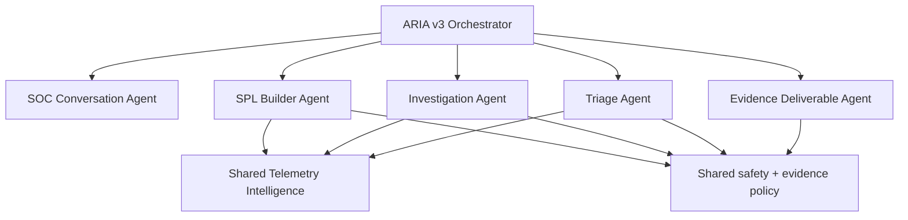
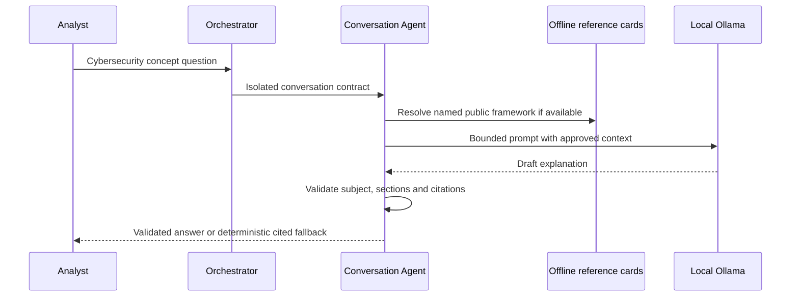
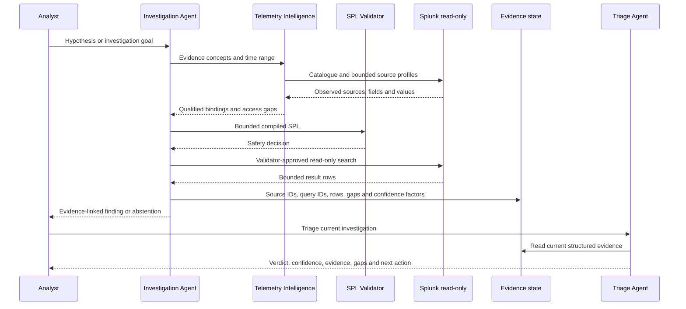

# ARIA Pattern B Architecture

ARIA v3.0.0-rc11 is a lightweight, air-gapped SOC copilot that connects a browser-based analyst workspace, local Ollama inference and live Splunk Enterprise evidence through a deterministic control plane.

The design principle is:

> The model proposes and explains. Splunk proves. Deterministic services enforce. Analysts approve.

## 1. Reference deployment

All components run inside the same approved or air-gapped trust boundary. Endpoints and ports are configurable; values below are defaults or typical services, not embedded customer assumptions.



### Server responsibilities

| Component | Responsibility | Default exposure | Authority |
|---|---|---|---|
| Analyst browser | Conversation, workspace, evidence and action views | Browser to approved ARIA interface | Submits goals and approvals |
| ARIA agentic server | Routing, agents, telemetry intelligence, SPL compiler, validator, evidence state, audit and UI | Product UI `8501`; local model gateway `8502` by default | Read-only Splunk client; no operational write authority |
| Ollama server | Local chat inference and embeddings | Ollama API, commonly `11434`, inside the enclave | No Splunk credentials; no tool or write authority |
| Splunk Enterprise / ES | System of record for catalogue, schema and returned events | Splunk management/search API, commonly `8089`, inside the enclave | Dedicated least-privilege read-only account |

## 2. Runtime architecture

One analyst request becomes two controlled data paths:

- **Reasoning path:** a bounded semantic or explanation task is sent to local Ollama. The model does not choose the product route, receive Splunk credentials or authorise execution.
- **Evidence path:** deterministic services discover the live catalogue, corroborate observed schema, compile and validate bounded SPL, and query Splunk through a read-only client only when the selected capability permits it.



## 3. Agents and relationships

ARIA exposes four principal analyst-facing agents and one deterministic evidence-deliverable agent. Utility capabilities remain deterministic and do not create additional execution authority.



| Agent or route | Input | Output | Splunk behaviour |
|---|---|---|---|
| Identity | Capability-help question | Product identity and supported skills | No query |
| SOC Conversation Agent | Cybersecurity or Splunk concept | Six-section bounded explanation; optional cited offline grounding | No query |
| Telemetry Inventory | Request for available data | Live indexes, sourcetypes, time coverage and access gaps | Read-only catalogue queries |
| SPL Builder Agent | Behaviour plus analyst constraints | Portable SPL and, where proven, deployment-qualified SPL | Qualification probes only; final SPL is not executed |
| SPL Review | Generated SPL in current context | Stage explanation, safety assessment and validation gaps | No query |
| Investigation Agent | Threat hypothesis, entity or observable goal | Qualified sources, safe executed SPL, returned evidence, gaps and confidence | Bounded read-only searches |
| Triage Agent | Finding/entity or current Investigation evidence | Verdict, confidence, evidence, contradictions, gaps and next action | Reuses evidence; a new bounded query only when its contract requires evidence location |
| Evidence Deliverable Agent | Current structured Investigation/Triage result | Detection Candidate, RBA/ERS, TDIR or SOAR draft | No new query and no operational action |
| Safety | Destructive or write-capable request | Refusal and boundary explanation | No query |
| Scope Guard | Non-SOC request | Scoped refusal and supported alternatives | No query |

## 4. Deterministic control plane

The control plane is implemented primarily in:

- `aria/v3/orchestrator.py` — request lifecycle, current structured result and agent handoff;
- `aria/v3/router.py` — deterministic capability classification and route precedence;
- `aria/v3/contracts.py` — product response and evidence contracts;
- `aria/v3/telemetry_intelligence.py` — live catalogue and observed-schema services;
- `aria/spl_validator.py` — static read-only SPL safety validation;
- `product/safety_policy.json` — executable-query boundaries;
- `product/evidence_policy.json` — qualification and evidence rules;
- `product/risk_policy.json` — risk eligibility controls.

The model cannot:

- select a write-capable route;
- bypass the SPL validator;
- invent a customer field binding and mark it deployment-qualified;
- turn schema presence or event volume into maliciousness;
- activate a detection, risk event, containment action or SOAR playbook.

## 5. Data flows

### 5.1 SOC Conversation



The Conversation Agent does not inherit Investigation, Triage or SPL Builder response prose. A named framework follow-up uses bounded same-agent context only.

### 5.2 SPL Builder

```mermaid
sequenceDiagram
  participant A as Analyst
  participant B as SPL Builder
  participant L as Local Ollama
  participant T as Telemetry Intelligence
  participant S as Splunk read-only
  participant V as SPL Validator

  A->>B: Behaviour and analyst constraints
  B->>L: Semantic-intent contract only
  L-->>B: Structured semantic plan
  B->>B: Compile portable SPL with placeholders
  B->>T: Request live candidates and observed schema
  T->>S: Bounded catalogue/profile probes
  S-->>T: Sources, fields and sample observations
  T-->>B: Corroborated bindings and explicit gaps
  B->>V: Validate proposed deployment SPL
  V-->>B: Pass or refuse
  B-->>A: Portable and qualified variants; final execution = NO
```

Required aggregation measurement and grouping fields need semantic similarity plus deterministic lexical corroboration. When any required field cannot be proven, ARIA preserves the portable SPL and returns `NO_SCHEMA_QUALIFIED_SPL`.

### 5.3 Investigation and Triage



`EVIDENCE_FOUND` means a qualified query returned evidence; it is not a true-positive security verdict. `INSUFFICIENT_EVIDENCE` remains a valid controlled outcome.

### 5.4 Detection, RBA/ERS, TDIR and SOAR drafts

```mermaid
sequenceDiagram
  participant A as Analyst
  participant O as Orchestrator
  participant G as Current structured evidence
  participant D as Evidence Deliverable Agent

  A->>O: Draft evidence-bound operational artefact
  O->>G: Retrieve current Investigation/Triage result
  G-->>D: Sources, queries, rows, verdict and gaps
  D->>D: Apply deterministic eligibility and approval policy
  D-->>A: Analyst-review draft; no query and no action
```

Missing risk-object evidence produces `NOT_ELIGIBLE` and `NOT CALCULATED`, not an invented score.

## 6. Evidence state

The evidence ledger is a structured runtime result carried by the orchestrator and analyst workspace. It is not a free-form summary and not a claim that every field is persistent indefinitely.

Typical identifiers and controls include:

- `SRC-*` — live source qualification evidence;
- `QRY-*` — safety-approved executed query evidence;
- returned row references and bounded event counts;
- observed field population and required-field co-occurrence;
- qualification/execution consistency;
- supporting, contradicting and missing evidence;
- deterministic confidence factors and penalties;
- analyst-supplied constraints and approval state.

## 7. Trust and approval boundaries

| Boundary | Enforced behaviour |
|---|---|
| Model boundary | Local model receives only bounded task/evidence context; no Splunk credentials or write authority |
| Splunk boundary | Dedicated read-only account; validator-approved bounded searches only |
| Builder boundary | Final generated SPL is not executed by BUILD_SPL |
| Evidence boundary | Definitive claims require returned evidence identifiers; gaps remain explicit |
| Risk boundary | No score without eligible evidence and validated risk object |
| Operational boundary | Detection activation, risk/notable writeback, containment and SOAR execution remain outside RC11 |
| Human boundary | Analyst or incident-commander approval is required before operationalisation |

## 8. Failure behaviour

- Unsupported telemetry or bindings produce explicit gaps or abstention.
- Local model timeout does not relax routing, evidence or SPL safety policy.
- Grounded framework failure can return a deterministic cited rendering of the same approved card.
- One failed agent is isolated and does not disable Inventory, Safety or Scope Guard.
- Transactional deployment compiles and checks the candidate before replacement and restores the prior runtime after a failed post-copy validation.

## 9. Repository code map

| Path | Purpose |
|---|---|
| `web_ui.py` | Browser analyst workspace |
| `aria_llm_gateway.py` | Local API boundary for product/UI and Ollama access |
| `main.py` | CLI entry point |
| `aria/v3/` | RC11 orchestrator, router and agents |
| `aria/copilot/` | Shared evidence qualification, planning, rendering and legacy-compatible services |
| `aria/splunk_client.py` | Splunk REST client |
| `aria/ollama_client.py` | Ollama client |
| `aria/spl_validator.py` | Deterministic SPL safety gate |
| `product/` | Versioned safety, evidence, risk and reference-knowledge policy |
| `scripts/` | Tests, audits, acceptance, deployment and packaging |
| `docs/` | Architecture, operation, demo, security and publication documentation |
| `.github/` | CI validation, dependency updates and contribution templates |

## 10. Deployment assurance

Before use:

1. Run `python validate_v3_acceptance.py --skip-live` against the exact source state.
2. Configure only `.env`; never commit it.
3. Use a dedicated Splunk read-only account and approved source access.
4. Complete connected acceptance with approved positive-control telemetry.
5. Confirm `ARIA_V3_LIVE_ACCEPTANCE=PASS` and `ARIA_V3_FINAL_ACCEPTANCE_STATUS=PASS`.
6. Treat RC11 as a controlled-preview release candidate, not an autonomous-response platform.

See [Installation](INSTALLATION.md), [Configuration](CONFIGURATION.md), [Acceptance](V3_ACCEPTANCE.md) and [Security Model](../SECURITY_MODEL.md).
