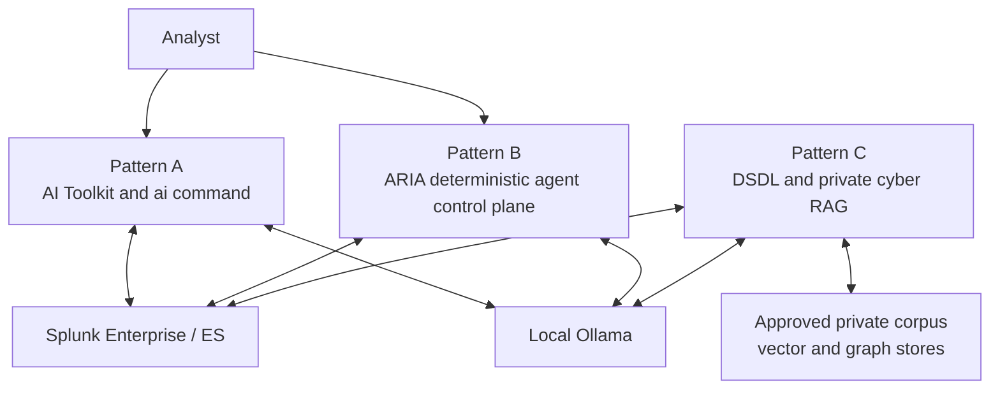
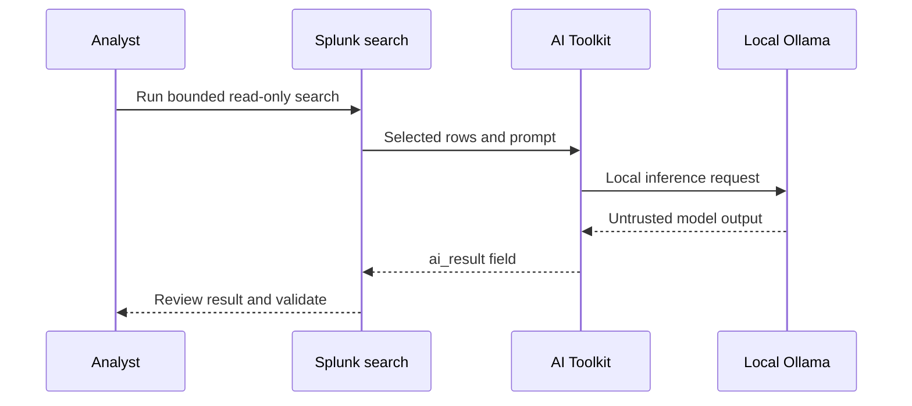
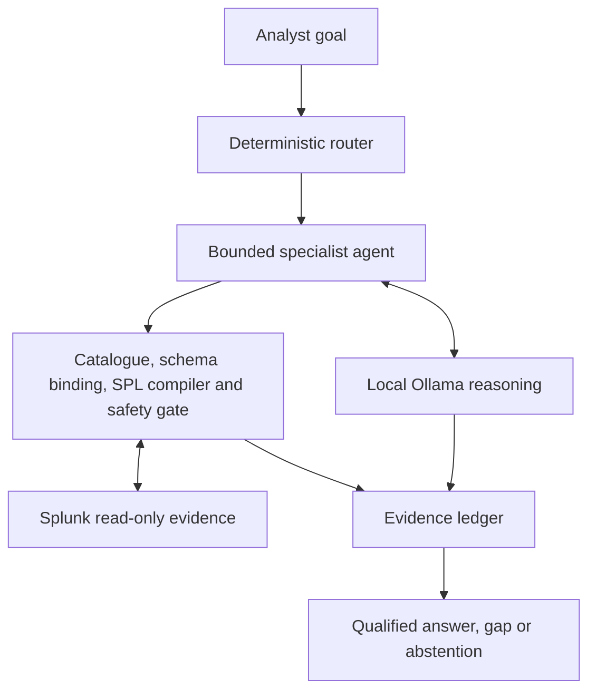
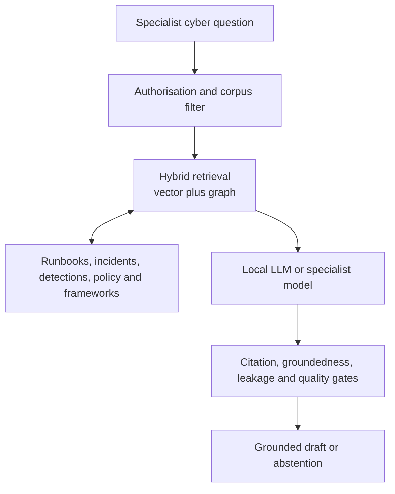

# SEC1436 three-pattern architecture

## Purpose

The three patterns show a progressive architecture for private AI in a Splunk SOC. All services remain inside an approved trust boundary. Splunk remains the evidence system of record and no cloud model is required.

These are parallel patterns within the same enclave. Pattern C is not in the RC11 runtime path, and Pattern A does not call Pattern B automatically.

## Pattern A — inference in the SPL pipeline

Pattern A is the fastest route to value. It is suitable for summarisation, explanation and proposal generation over small, explicitly selected inputs. The `ai_result` field is not evidence, a validated ATT&CK mapping or deployment-safe SPL until an analyst or additional control validates it.

## Pattern B — agentic evidence control plane

Pattern B separates model reasoning from deployment facts. The model has no Splunk credentials or operational write authority. Detection, RBA/ERS, TDIR and SOAR outputs remain approval-gated drafts.

## Pattern C — specialised retrieval and model lifecycle

DSDL supplies containerised custom-model and notebook workflows. A future ARIA integration would still need deterministic corpus access, provenance, evaluation and approval controls. Vector similarity alone is not an evidence decision.

## Trust boundaries

| Boundary | Required control |
|---|---|
| Air-gap boundary | Pre-stage approved packages, models and container images; no hidden outbound dependency |
| Splunk boundary | Least-privilege identities, bounded searches and explicit command capabilities |
| Model boundary | Treat all model output as untrusted; no credentials or direct action authority |
| Data boundary | Minimise fields and rows; apply classification, retention and corpus ACLs |
| Evidence boundary | Cite returned Splunk rows or approved corpus chunks; keep gaps explicit |
| Operational boundary | Human approval before detection promotion, risk/notable writes or response actions |
| Supply-chain boundary | Verify checksums, licences, SBOMs and vulnerability scans before importing artefacts |

## Reference deployment

The demonstrated environment uses separate Splunk, agentic and Ollama servers. Pattern A runs from the Splunk search tier to Ollama. Pattern B runs on the agentic server and connects independently to Splunk and Ollama. Pattern C requires an approved DSDL container environment and private retrieval stores; it is not assumed to be present in the current no-container RC11 deployment.

