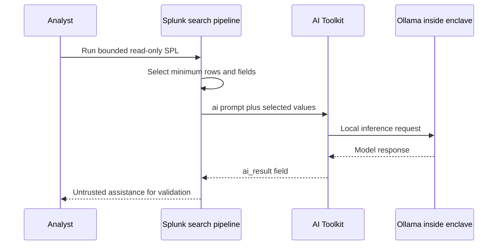
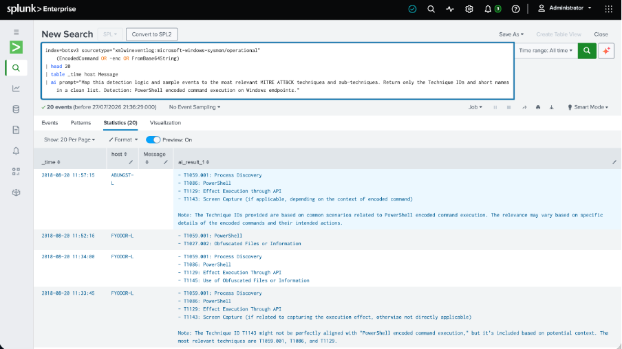
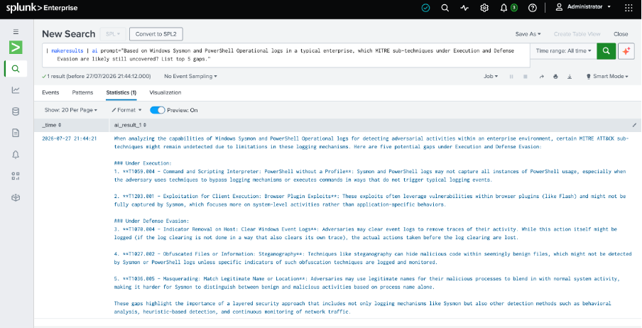
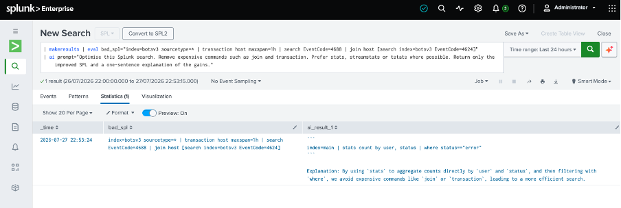
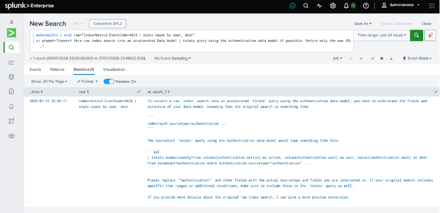
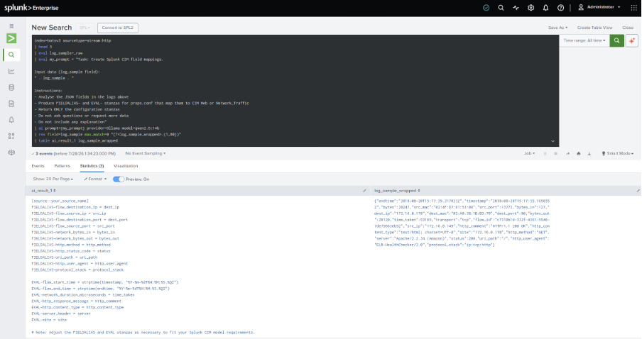

# Pattern A — Splunk AI Toolkit `| ai` to local Ollama

Pattern A is the fastest way to demonstrate private LLM inference from a Splunk search. A bounded read-only SPL pipeline selects the minimum required data, the AI Toolkit sends that input to an approved local Ollama model, and the result returns to Splunk as an `ai_result_*` field.

**Status:** validated conference demonstration pattern. Pattern A is not the ARIA RC11 evidence control plane and does not make model output authoritative.

## What the screenshots prove

The supplied captures demonstrate that the local model connection works for five SOC-assistance scenarios:

| Demonstration | Useful outcome | Validation boundary |
|---|---|---|
| Event-to-MITRE assistance | Proposes ATT&CK techniques from selected event text | Technique identifiers and names must be checked against a pinned local ATT&CK release; the capture contains stale or incorrect identifiers |
| Coverage-gap hypotheses | Suggests behaviours that may not be visible in a telemetry set | Treat as hypothesis generation, not proof of coverage or absence |
| SPL optimisation assistance | Proposes a simpler SPL form | Must preserve source scope, time, joins, grouping and semantics; the captured rewrite drops material logic |
| Raw-search-to-`tstats` assistance | Suggests a CIM/Data Model form | Valid only after CIM mapping, field population, data-model constraints and acceleration are verified |
| JSON-to-CIM assistance | Proposes `FIELDALIAS` and `EVAL` mappings | Generated `.conf` content requires syntax, collision, type and sample-event validation before deployment |

These limitations are a feature of the story: Pattern A proves local inference; Pattern B adds deterministic routing, evidence qualification, safety gates and abstention.

## Data flow

Splunk documentation states that the `ai` command supports Ollama, can process fields or events, does not inspect model input and does not add response guardrails. It also identifies the command as performance-sensitive. Those points drive the controls in this pattern.

## Start here

1. Review [installation and connection guidance](INSTALLATION.md).
2. Apply the [security and validation controls](SECURITY_AND_VALIDATION.md).
3. Read the [formal screenshot validation report](VALIDATION_REPORT.md).
4. Select a use case from [the validated demonstration catalogue](USE_CASES.md).
5. Replace every visible placeholder in [the portable SPL templates](examples/PORTABLE_SPL_TEMPLATES.md) using an analyst-authored source and observed fields.
6. Run only in an approved non-production or read-only environment until the result and performance envelope are accepted.

The earlier demonstration selected `qwen2.5:32b`, with `qwen2.5-coder:7b` as a faster fallback. Model choice remains deployment-specific and is deliberately represented as `<LOCAL_MODEL>` in reusable examples.

## Screenshots

| Event-to-MITRE assistance | Coverage-gap hypotheses |
|---|---|
|  |  |

| SPL optimisation | Raw search to `tstats` |
|---|---|
|  |  |

The screenshots contain public laboratory/demo data and analyst-supplied searches. Their index, sourcetype, fields, event identifiers, entities and model answers are not defaults, product logic or evidence of any customer deployment.

## Authoritative references

- [Splunk AI Toolkit: About the `ai` command](https://help.splunk.com/en/splunk-enterprise/apply-machine-learning/use-ai-toolkit/5.7.1/ai-toolkit-commands-macros-and-visualizations/about-the-ai-command)
- [Splunk AI Toolkit connections and LLM permissions](https://help.splunk.com/en/splunk-enterprise/apply-machine-learning/use-ai-toolkit/6.0.0/ai-toolkit-connections-containers-and-agents)
- [Splunk AI Toolkit release notes](https://help.splunk.com/en/splunk-enterprise/apply-machine-learning/use-ai-toolkit/6.0.0/release-notes/whats-new-in-the-ai-toolkit)
- [MITRE ATT&CK Enterprise techniques](https://attack.mitre.org/techniques/enterprise/)

Documentation and screenshot assessment last reviewed on 2026-08-04. Verify the documentation matching the versions approved in your environment.
