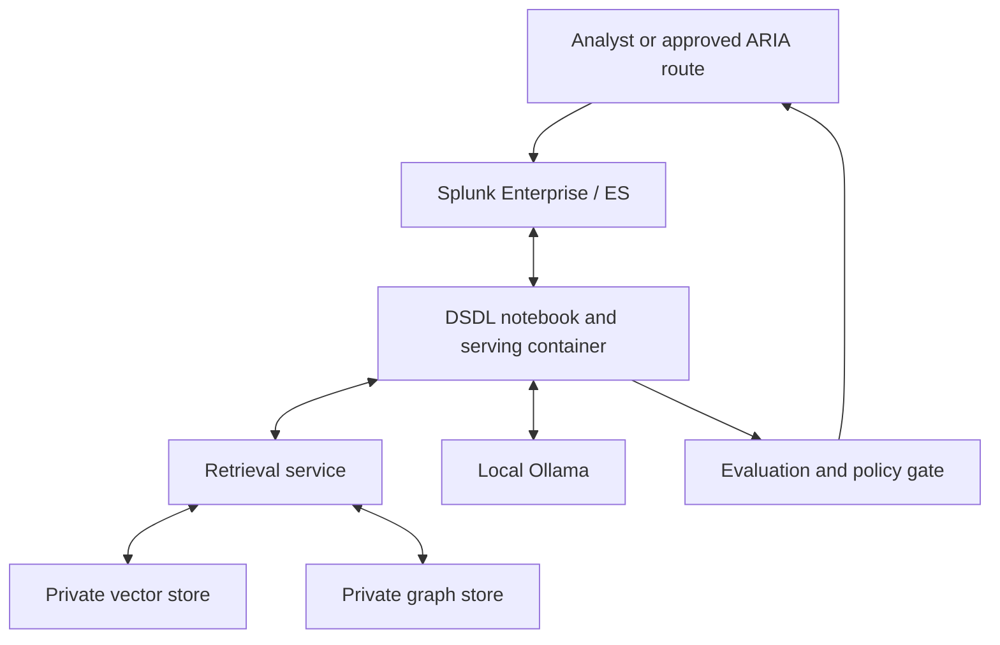

# Pattern C — DSDL and private cyber RAG

Pattern C is the “capabilities to try next” layer for SEC1436. It explores how the Splunk App for Data Science and Deep Learning (DSDL) could add private retrieval, graph context, specialist models and model-lifecycle workflows inside an approved enclave.

**Status:** experimental roadmap. Pattern C is not implemented in ARIA v3.0.0-rc11, is not required to run Pattern B and must not be presented as a released product commitment.

## Why DSDL belongs in the roadmap

DSDL supports custom machine-learning and deep-learning workflows through Jupyter notebooks and container runtimes, with familiar `fit`, `apply` and `summary` operationalisation patterns. Current DSDL documentation also describes an LLM-RAG stack with local Ollama, local embeddings, vector stores and graph stores.

This creates a credible path from a general local assistant to specialist SOC capabilities:

- private RAG over runbooks, incidents, detections, local policy and approved framework content;
- provenance-aware MITRE ATT&CK and MITRE ATLAS analysis;
- hybrid vector and graph retrieval for entity relationships and attack paths;
- specialist DGA/DNS, anomaly, classification and sequence models;
- repeatable evaluation, model cards, versioning and promotion gates;
- safe malware-pattern and synthetic-telemetry research in isolated laboratories.

## Architecture

## Important deployment constraint

The current RC11 three-server deployment assumes no container platform. DSDL requires an approved Docker, Kubernetes or OpenShift environment, and the documented DSDL LLM-RAG setup is Docker-specific. Pattern C therefore needs separate infrastructure, supply-chain and security approval before experimentation.

For an air-gapped implementation, pre-stage and verify the required Splunk apps, container images, Python dependencies, models and database artefacts. Replace public image pulls with an approved internal registry/import process.

## What to build first

1. Establish a container and offline artefact-import baseline.
2. Build the evaluation harness before the assistant.
3. Start with a small access-controlled runbook and policy corpus.
4. Require citations and abstention when retrieval is weak.
5. Add ATT&CK/ATLAS and detection content with pinned versions.
6. Add graph retrieval only after entity identifiers and access rules are reliable.
7. Promote specialist models only after benchmark, drift and rollback criteria pass.

See:

- [Capabilities to try next](CAPABILITIES_TO_TRY_NEXT.md)
- [Phased experiment backlog](EXPERIMENT_BACKLOG.md)
- [Security and evaluation gates](SECURITY_AND_EVALUATION.md)
- [Three-pattern architecture](../../docs/SEC1436_THREE_PATTERN_ARCHITECTURE.md)

## Authoritative references

- [About the Splunk App for Data Science and Deep Learning](https://help.splunk.com/en/splunk-cloud-platform/apply-machine-learning/use-splunk-app-for-data-science-and-deep-learning/5.1.0/introduction-to-the-splunk-app-for-data-science-and-deep-learning/about-the-splunk-app-for-data-science-and-deep-learning)
- [Set up DSDL LLM-RAG](https://help.splunk.com/en/splunk-cloud-platform/apply-machine-learning/use-splunk-app-for-data-science-and-deep-learning/5.2.0/llm-rag-assistants/set-up-llm-rag)
- [Configure DSDL LLM, embedding, vector and graph services](https://help.splunk.com/en/splunk-cloud-platform/apply-machine-learning/use-splunk-app-for-data-science-and-deep-learning/5.2.0/llm-rag-assistants/set-up-additional-llm-rag-configurations)

Documentation reviewed on 2026-08-04. Confirm the requirements for the exact DSDL version approved in the target environment.

